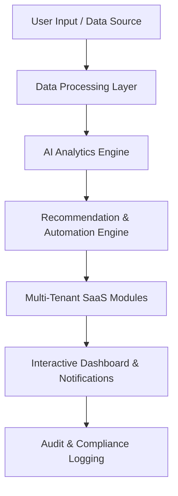

# 🧠 OmniSaaS Engine

Enterprise-grade AI-powered SaaS platform combining analytics, workflow automation, and real-time collaboration. Intelligent decision-making, task optimization, and seamless enterprise integration.

**[Features](#-features)** •
**[Architecture](#-architecture)** •
**[Tech Stack](#-tech-stack)** •
**[Setup](#-getting-started)** •
**[Impact](#-real-world-impact)**

---

## 🎯 Overview

**OmniSaaS Engine** is a fully-featured, enterprise-grade platform that combines AI-powered analytics, workflow automation, and real-time collaboration tools in a single, scalable SaaS application.

### Key Capabilities:

- 🤖 **AI-Driven Analytics** - Real-time insights from structured and unstructured data
- 📊 **Collaborative Dashboards** - Team-based KPI and project visualization
- ⚙️ **Smart Automation** - AI-triggered actions and workflow optimization
- 🔔 **Intelligent Alerts** - Context-aware notifications via email, SMS, or in-app
- 🏢 **Enterprise Ready** - Multi-tenant support with role-based access control
- 🔌 **Integrated Ecosystem** - Connectors for CRM, ERP, cloud storage, and more
- 💡 **AI Recommendations** - Suggest optimized actions and resource allocation
- 📋 **Full Compliance** - Complete audit logging and traceability

---

## ✨ Features

| Feature | Description |
|---------|-------------|
| 🤖 **AI-Driven Analytics** | Real-time insights from structured and unstructured data using predictive and prescriptive models |
| 📊 **Collaborative Dashboards** | Team-based dashboards for visualizing KPIs, tasks, and project progress |
| ⚙️ **Workflow Automation** | Automate repetitive business processes with AI-triggered actions |
| 🔔 **Smart Notifications** | Context-aware alerts via email, SMS, or in-app messaging |
| 🔐 **Enterprise Security** | Granular role-based access with isolated data per tenant |
| 🧩 **Modular Architecture** | Add or remove components based on business requirements |
| 🚀 **Highly Scalable** | Horizontal and vertical scaling for high concurrency |
| 🔗 **Integration Ecosystem** | Pre-built connectors for CRM, ERP, cloud storage, messaging |
| 💡 **AI Recommendations** | Suggests optimized actions and task prioritization |
| 📋 **Audit & Compliance** | Full logging of actions, recommendations, and workflows |

---

## 🏗️ Architecture

### System Components

| Component | Purpose |
|-----------|---------|
| **Data Processing Layer** | Aggregates and normalizes data from APIs, databases, and user inputs |
| **AI Analytics Engine** | Runs predictive and prescriptive models to generate insights |
| **Recommendation Engine** | Determines AI-driven actions and triggers workflow automation |
| **Multi-Tenant Modules** | Provides isolated, secure access based on subscription or role |
| **Dashboard & Notifications** | Real-time visualization and context-aware alerting |
| **Audit & Compliance** | Captures all interactions for security and traceability |

---

## 📈 Real-World Impact

| Benefit | Improvement |
|---------|-------------|
| ⏱️ **Operations** | Reduces manual analysis and overhead by 50–70% |
| 🧠 **Decision Making** | Enhanced with AI-powered predictive insights |
| 👥 **Collaboration** | Real-time dashboards for enterprise teams |
| 📈 **Scalability** | Seamlessly supports thousands of users and tenants |
| 🔌 **Integration** | Easy connection with existing enterprise systems |

---

## 🛠️ Tech Stack

### Frontend
- **Framework:** React 18
- **State Management:** Redux Toolkit
- **Styling:** TailwindCSS
- **Visualization:** Recharts, D3.js

### Backend
- **Language:** Python 3.11
- **Framework:** FastAPI
- **Task Queue:** Celery + Redis
- **API:** GraphQL

### AI/ML
- **LLM:** OpenAI GPT / Gemini API
- **Models:** Custom predictive & prescriptive models

### Infrastructure
- **Primary Database:** PostgreSQL
- **Cache & Queue:** Redis
- **Document Store:** MongoDB
- **Message Queue:** RabbitMQ, Kafka
- **Containerization:** Docker
- **Orchestration:** Kubernetes
- **Cloud:** AWS (EKS, Lambda, S3)
- **Monitoring:** Prometheus & Grafana

---

## 📊 Platform Modules

### Analytics Module
- Real-time KPI tracking
- Predictive trend analysis
- Custom metric creation
- Historical data comparison

### Automation Module
- Vision-based workflow builder
- AI-triggered actions
- Scheduled task management
- Integration templates

### Collaboration Module
- Team dashboards
- Real-time notifications
- Task assignment
- Progress tracking

### Integration Module
- CRM connectors
- ERP handlers
- Cloud storage sync
- Messaging integrations

---

## 🔐 Security & Compliance

- **Authentication:** JWT with Multi-Factor Authentication (MFA)
- **Authorization:** Fine-grained Role-Based Access Control (RBAC)
- **Encryption:** End-to-end encryption for data in transit and at rest
- **Data Isolation:** Dedicated tenant data stores
- **Audit Logging:** Complete activity tracking and reporting
- **Compliance:** GDPR, HIPAA, SOC 2 ready
- **Rate Limiting:** API rate limiting and DDoS protection

---

## 🤝 Contributing

Contributions are welcome! Please follow these guidelines:

1. Fork the repository
2. Create a feature branch (`git checkout -b feature/AmazingFeature`)
3. Commit your changes (`git commit -m 'Add AmazingFeature'`)
4. Push to the branch (`git push origin feature/AmazingFeature`)
5. Open a Pull Request

---

## 📄 License

MIT License © Daniel Lopez

See [LICENSE](LICENSE) for details.

---

## 👤 Author

**Daniel Lopez**

Email: daniellopezorta39@gmail.com

GitHub: [daniellopez882](https://github.com/daniellopez882)